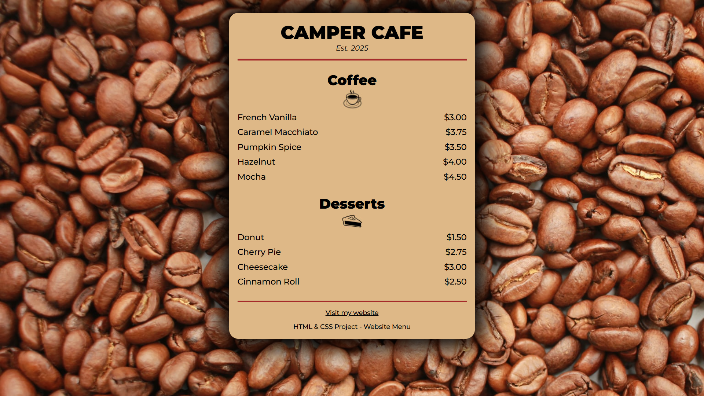

# ☕ Camper Cafe Menu

A simple project built with **HTML, CSS, and JavaScript** that displays a coffee shop menu.  
The design is clean and minimalistic, featuring a coffee beans background and a centered card with drinks and desserts.

## 📂 Project Structure
- `index.html` – Main webpage  
- `styles.css` – Styling for the layout, colors, and fonts  
- `index.js` – Small script that displays the current year in the footer  
- `/assets` – Images used for the favicon, background, and icons  

## 🚀 How to Run
1. Clone this repository:
  ```
   git clone https://github.com/AlexOnData/Uni_Website_CafeMenu.git
  ```
2. Open the index.html file in your browser.

## ✨ Features
- Responsive, centered layout
- Coffee and dessert lists with prices
- Footer with a personal website link and dynamic current year

## 📸 Preview

